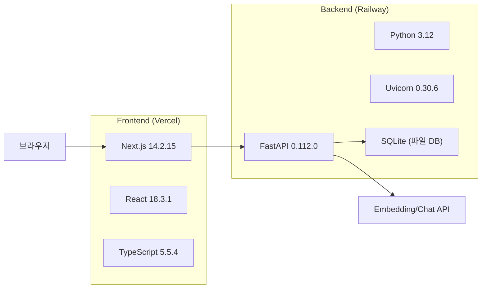
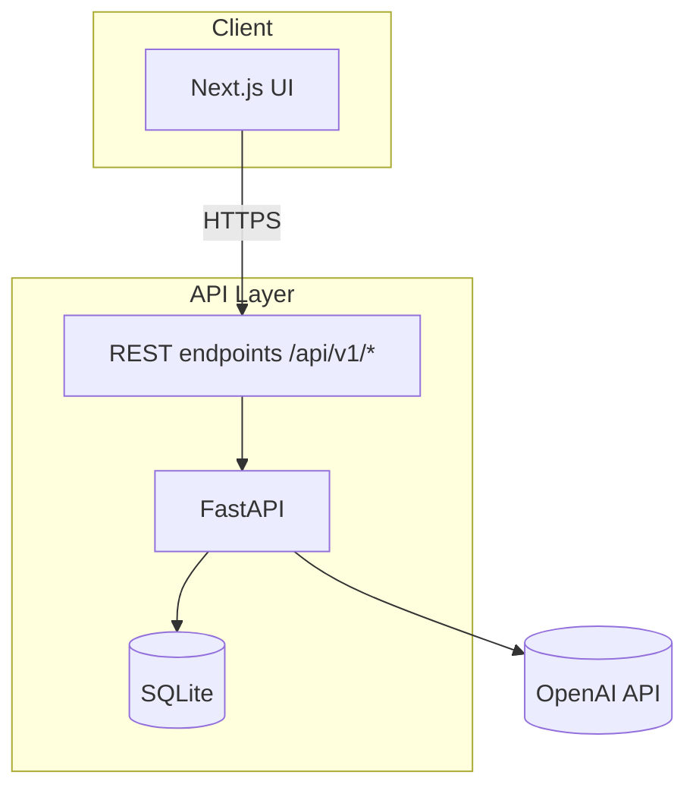

# Knowledge Copilot - AI Document Copilot

> **한 문서에서 근거 기반으로 답하는 팀형 지식 동반자**
>
> 업로드한 문서를 임베딩하고, 검색 기반 질의와 액션 API를 제공하는 풀스택 AI 포트폴리오 프로젝트입니다.

<div align="center">

[](https://github.com/doublesilver/knowledge-copilot/actions)
[](https://github.com/doublesilver/knowledge-copilot/actions/workflows/ci-cd.yml)
[](https://vercel.com)
[](https://railway.app)

</div>

---

## 프로젝트 개요

| 항목 | 내용 |
|------|------|
| **프로젝트명** | Knowledge Copilot |
| **유형** | AI 문서 질의/요약 MVP (포트폴리오) |
| **개발 기간** | 2026-02-27 기준 구축 단계 |
| **개발 인원** | 1인 풀스택 |
| **현재 버전** | v0.1.0 |
| **서비스 URL** | 배포 URL 별도 등록(공개 도메인 미공개) |

---

## 주요 기능

| 기능 | 설명 |
|------|------|
| **문서 업로드** | 텍스트/파일 기반 문서를 업로드해 인덱싱 |
| **RAG 질의** | 문서 기반 근거가 포함된 답변 반환 |
| **문서 상세 조회** | 업로드한 문서/청크 기반 조회 |
| **피드백 수집** | 질의 결과 평점 및 메모 저장 |
| **액션 실행** | 사전 정의된 액션 API 엔드포인트 제공 |
| **운영 메트릭** | 질의 수, 지연시간, 피드백 지표 조회 |
| **CI/CD 자동 배포** | `dev`/`main` 브랜치 기준 자동 배포 |

---

## 기술 스택



### 스택 정리

| 영역 | 사용 기술 |
|------|----------|
| Frontend | Next.js, React, TypeScript |
| Backend | FastAPI, Pydantic, Uvicorn |
| Storage | SQLite (프로토타입 DB) |
| AI | OpenAI(임베딩/챗 모델, 옵션) |
| 배포 | Vercel, Railway, GitHub Actions |
| 테스트 | pytest |

---

## 아키텍처



### API 엔드포인트

| 메서드 | 경로 | 용도 |
|--------|------|------|
| GET | `/api/v1/health` | 헬스체크 |
| POST | `/api/v1/documents` | 문서 업로드 |
| GET | `/api/v1/documents` | 문서 목록 |
| GET | `/api/v1/documents/{id}` | 문서 상세 |
| POST | `/api/v1/queries` | 질의 처리 |
| GET | `/api/v1/queries/{id}` | 질의 상세 |
| POST | `/api/v1/evals` | 사용자 피드백 수집 |
| POST | `/api/v1/agent/actions` | 액션 실행 |
| GET | `/api/v1/metrics` | 운영 메트릭 |

---

## 프로젝트 구조

```text
project3/
├── app/                  # Next.js 프론트엔드
│   ├── src/
│   ├── public/
│   └── package.json
├── api/                  # FastAPI 백엔드
│   ├── src/
│   ├── requirements.txt
│   ├── Dockerfile
│   └── pytest
├── docs/                 # 배포/로드맵 문서
├── .github/workflows/    # CI/CD
├── scripts/              # 배포 전 검증 스크립트
└── .env, .env.example    # 로컬 환경설정
```

---

## 로컬 실행 방법

### 사전 설치

- Node.js 20+
- Python 3.12+

### Backend 실행

```bash
cd api
cp ../.env.example ../.env  # 최초 1회
python -m venv .venv
source .venv/bin/activate   # Windows: .venv\\Scripts\\activate
pip install -r requirements.txt
uvicorn src.main:app --reload --env-file ../.env
```

### Frontend 실행

```bash
cd app
npm install
npm run dev
```

### 통합 실행

```bash
docker compose up --build
```

### 체크리스트

```bash
cd api
python -m pytest -q

cd ../app
npm run build
```

---

## 배포/운영

### Git 기반 자동 배포 전략

- **dev / development 브랜치 push**: 개발 환경 배포(Development)
- **main 브랜치 push**: 실운영 배포(Production)
- `main` 배포는 운영 정책상 `dev` 검증 흐름 이후 반영

### 배포 산출물

- Frontend: Vercel (`app` 디렉터리 기준)
- Backend: Railway (`api` 디렉터리 기준)

### GitHub Actions 필수 Secret

- `VERCEL_TOKEN`
- `VERCEL_SCOPE`
- `RAILWAY_DEV_DEPLOY_HOOK`
- `RAILWAY_PROD_DEPLOY_HOOK`

Railway 배포는 더 이상 `RAILWAY_TOKEN`을 사용하지 않고, GitHub Actions에서 각 환경별 Deploy Hook URL을 호출해 배포를 트리거합니다.

---

## 테스트

현재 기준으로 검증 가능한 항목

- `pytest` (백엔드 단위/API 기본 테스트)
- `npm run build` (Next.js 빌드 검증)
- GitHub Actions 체크 자동화

```bash
cd api
python -m pytest -q

cd ../app
npm run build
```

---

## 개발 타임라인

- v0.1.0: CI/CD 안정화 및 문서화 정리
- v0.2.0: 질문 정합성 개선, 프롬프트 강화
- v0.3.0: 인증/권한, 멀티테넌트, 지표 대시보드 고도화

---

## 보안 & 운영 노트

- OpenAI 키/토큰은 `.env` 또는 플랫폼 Secret으로만 관리
- CORS는 환경별로 제한하여 배포
- 파일 업로드는 UTF-8 텍스트 기반 처리로 제한
- SQLite는 포트폴리오/샘플 단계의 저장소로, 운영 요구 시 PostgreSQL 교체 고려

---

## 문서

- [DEPLOYMENT.md](./docs/DEPLOYMENT.md)
- [ROADMAP.md](./docs/ROADMAP.md)
- [CI/CD workflow](.github/workflows/ci-cd.yml)

---

## License

MIT License

---

<div align="center">

이 프로젝트는 포트폴리오 제출 및 면접용 실무형 구현 역량 증빙 목적입니다.

**Made for practical AI engineering interview readiness.**

</div>
